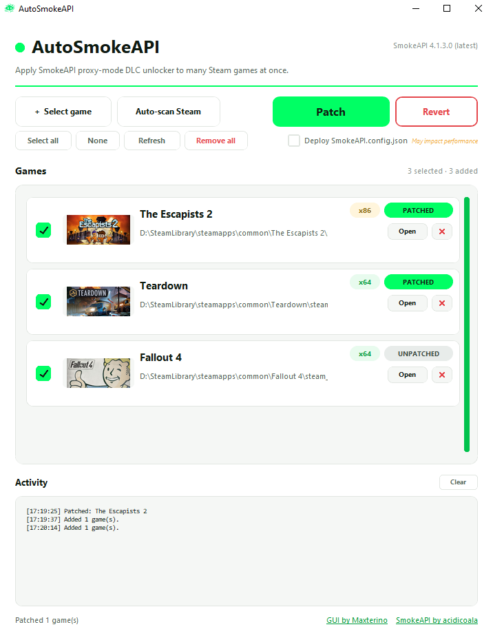

# AutoSmokeAPI

A simple Windows app that applies **[SmokeAPI](https://github.com/acidicoala/SmokeAPI)** - a Steam DLC unlocker - to many games at once.

Pick your games (or auto-scan), click **Patch**, done. Click **Revert** to undo.



---

## Download

**[Download the latest release →](https://github.com/Maxterino/AutoSmokeAPI/releases/latest)**

1. Download `AutoSmokeAPI-vX.Y.Z.zip`
2. Right-click → **Extract All…** (anywhere - your Desktop is fine)
3. Open the extracted folder and double-click **`AutoSmokeAPI.exe`**

No installation. No Python. No setup. Everything is bundled inside the zip.

---

## How to use it

### Adding games

You have three ways to add games to the list:

- **Auto-scan Steam** - click the button. AutoSmokeAPI walks every drive looking for Steam libraries and adds all your installed games in a few seconds. Live progress is shown in the Activity log at the bottom.
- **+ Select game** - opens a file dialog. Browse to your game's folder and pick `steam_api.dll` or `steam_api64.dll`. Most games keep it next to the .exe, but some bury it in subfolders like `bin\x64\` or `Game_Data\Plugins\`.
- **Drag & drop** - drag a `steam_api.dll` / `steam_api64.dll` file from File Explorer onto the AutoSmokeAPI window.

Each game gets its Steam header image, an x86/x64 badge, and a status badge:

- **UNPATCHED** - original Steamworks DLL is there
- **PATCHED** - SmokeAPI is already in place
- **MISSING** - the DLL is gone (game was uninstalled or moved)

### Patching

Tick the games you want to patch and click the green **Patch** button. The app will:

1. Rename the game's `steam_api.dll` → `steam_api_o.dll` (or `steam_api64.dll` → `steam_api64_o.dll`)
2. Drop in SmokeAPI's DLL under the original name

Now launch the game - all DLCs are unlocked.

### Reverting

Tick the games you want to revert and click **Revert**. The original Steamworks DLL is restored from the `_o` backup. The game is back to vanilla.

### New DLC released?

You don't need to re-patch. SmokeAPI talks to Steam at runtime and unlocks any new DLC the game queries about. Just launch the game.

(Edge case: a few games hardcode their DLC list and don't ask Steam. For those, you'd need to manually edit `SmokeAPI.config.json` and add the new DLC IDs.)

### Keeping SmokeAPI up to date

The top-right of the window shows the bundled SmokeAPI version. When acidicoala publishes a new SmokeAPI release, an **Update available!** button appears underneath the version number. Click it → confirm → AutoSmokeAPI downloads the new release and replaces the bundled DLLs.

Your already-patched games keep working as-is. If you want them on the newer SmokeAPI, **Revert** then **Patch** them again.

---

## Troubleshooting

**Windows says "Windows protected your PC" when I open the .exe**
SmartScreen warns about any unsigned program. Click **More info → Run anyway**. AutoSmokeAPI is open-source and you can read every line of the source on this repo.

**My antivirus quarantined `AutoSmokeAPI.exe`**
This is a false positive - PyInstaller-built executables trip generic heuristics. Either add an exception in your antivirus, or build the .exe yourself from source (see below).

**"Couldn't rename steam_api64.dll" or "Permission denied"**
The game is probably running. Close it completely (including the launcher) and try again. If it still fails, your game is in `Program Files` - right-click AutoSmokeAPI.exe → **Run as administrator**.

**A patched game crashes on launch**
A small minority of games don't work with SmokeAPI's *proxy mode* (which is what this tool uses). Revert the patch, then look up the game on [SmokeAPI's docs](https://github.com/acidicoala/SmokeAPI#readme) for instructions about *hook mode + Koaloader* (manual setup).

**The auto-scan didn't find a game**
Some games keep their `steam_api.dll` in unusual places. Find it manually with File Explorer (search the game folder for `steam_api*.dll`) and add it via **+ Select game** or drag-and-drop.

---

## Privacy

AutoSmokeAPI talks to the internet for two things only:

- **Game cover art** - downloaded once from `cdn.cloudflare.steamstatic.com` per game, then cached locally in `.image_cache/`.
- **SmokeAPI updates** - checks `api.github.com/repos/acidicoala/SmokeAPI/releases/latest` on startup, and downloads from `github.com/acidicoala/SmokeAPI/releases/download/...` only when you click **Update available!**.

No telemetry. No analytics. No accounts.

---

## Build from source

Want to build the .exe yourself instead of trusting the prebuilt one? You'll need [Python 3.10+](https://www.python.org/downloads/) (tick "Add Python to PATH" during install).

```
git clone https://github.com/Maxterino/AutoSmokeAPI.git
cd AutoSmokeAPI
build.bat
```

`build.bat` installs the dependencies and runs PyInstaller. Output: `dist\AutoSmokeAPI\AutoSmokeAPI.exe`.

---

## Credits

- **SmokeAPI** - the underlying DLC unlocker - by [acidicoala](https://github.com/acidicoala/SmokeAPI). All credit for the actual unlocking work goes to them.
- **GUI** - by [Maxterino](https://github.com/Maxterino/AutoSmokeAPI).
